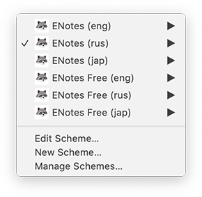

# ENotes

> Данная программа была написана в рамках курса «Разработка под iOS», проводившегося сотрудниками компании «Яндекс» на платформе “Stepik” в период с июня по август 2019.
>
> В настоящий момент данный курс закрыт, и согласно официальной информации его перезапуск не планируется. Все видео курса выложены компанией «Яндекс» в свободный доступ, и доступны для просмотра всеми желающими на платформе ~~«Яндекс.Видео»~~ “YouTube”:
> * [Разработка под iOS. Начинаем](https://www.youtube.com/playlist?list=PLQC2_0cDcSKA0zy20X9c5rQKNg3rkSK7c)
> * [Разработка под iOS. Взлетаем](https://www.youtube.com/playlist?list=PLQC2_0cDcSKAcuWNsWAwF8GT_lCU9QZNs)
>
> Конспект и задания любезно сохранены одним из участников данных курсов, Романом Бровко, и доступны для ознакомления в виде [репозитория на GitHub](https://github.com/programming086/note-course).

&nbsp;
## Логотип ENote

В рамках курса ученикам предлагалось разработать приложение для ведения заметок. В качестве проверки выполнения работы было предусмотрено проверочное тестирование приложений в формате peer review, т.е. сами участники курса проверяли работы друг друга.

Дабы выделиться из сотен одинаковых работ с логотипом в виде записной книжки, было принято решение нарисовать свой собственный логотип. Довольно быстро родилась идея обыграть схожесть слов "note" – "енот" (electronic note), и для использования в качестве маскота приложения был придуман, и нарисован енот с записной книжкой в лапках.

Этапы жизни «Енота»:

| Карандаш                    | Вектор                       | Приложение                  |
| --------------------------- | ---------------------------- | --------------------------- |
|  |  |  |

Данное изображение в различных модификациях используется в виде логотипа, загрузочного экрана, а также экрана уведомления о превышении бесплатного лимита.

&nbsp;
## Текстовые заметки

Текстовые заметки можно добавлять, изменять, удалять, и менять их порядок.

&nbsp;
## Создание и редактирование текстовой заметки

Страница редактирования заметки позволяет задать название, описание, конечную дату выполнения, а также присвоить заметке цвет.

### Поле описания

Поле описания заметки представляет собой TextView, с кастомным placeholder’ом, и изменяет свой размер в зависимости от размера содержимого текста заметки.

### Поле задания даты

Для заметки может быть указана дата крайнего срока её выполнения.

### Поле выбора цвета

У всех заметок есть цвет по умолчанию  (белый), но пользователь также может выбрать и любой другой цвет. Для индикации подтверждения выбора, на ячейке с цветом проставляется анимируемая галочка.

Данная галочка отрисовывается программно, при помощи Core Animation, и может быть сконфигурирована под различные цвета и размеры.

| Выбор цвета                     | Голосуй сердцем                | The Matrix is everywhere           |
| ------------------------------- | ------------------------------ | ---------------------------------- |
|  |  |  |

&nbsp;
### Ячейка выбора нестандартного цвета

Последняя ячейка своим видом намекает, что является нестандартной ячейкой. Её можно выбрать также как и любую другую, но помимо этого, данную ячейку можно подержать, вызвав тем самым окно выбора цвета.

Для того чтобы пользователь понял, что с данной ячейкой можно взаимодействовать длительным нажатием, к ней была добавлена анимация «расширяющихся кругов», прерываемая при прерывании касания.

&nbsp;
## Окно выбора нестандартного цвета.

Одним из заданий курса было создание собственного компонента выбора цвета.
Наиболее удобным способом выбора цвета является задание его в цветовой модели [HSB (она же HSV)](https://ru.wikipedia.org/wiki/HSV_(%D1%86%D0%B2%D0%B5%D1%82%D0%BE%D0%B2%D0%B0%D1%8F_%D0%BC%D0%BE%D0%B4%D0%B5%D0%BB%D1%8C)). Пользователю необходимо выбрать тон (hue), насыщенность (saturation) и яркость (brightness), что является гораздо более логичным и человекопонятным, нежели задание цвета в RGB-компонентах. Именно такая модель используется в большинстве графических программ по умолчанию, и именно такой компонент было решено создать для данного приложения.

В трёхмерном пространстве HSB модель можно представить в виде цилиндра.

Однако на плоскости обычно используется развёртка компонента «тон».

Для отрисовки вышеописанной HSB-модели в приложении, было использовано три градиента со следующими массивами цветовых остановок.

Два ортогональных, наложенных друг на друга градиента для компонентов тон-насыщенность:
* hue: [.red, .yellow, .green, .cyan, .blue, .magenta, .red]
* saturation: [.clear, .white]

И один для компонента яркости:
* brightness: [.black, currentColor]

При изменении любого параметра цвета, все остальные визуальные элементы перерисовываются.

Итоговый компонент выбора цвета представляет собой независимый `UIViewController`, который может быть использован в любом другом приложении. Его составные элементы: поле выбора яркости, поле выбора тона-насыщенности, окно, отображающее текущий выбранный цвет – также максимально независимы. Все они связываются с родительским `ViewController’ом` посредством делегатов, и в случае необходимости тоже могут быть переиспользованы.

Оба селектора (кружок в поле выбора тона и насыщенности и прямоугольник в поле выбора яркости цвета) не являются картинками, а отрисовываются программно в векторах, при помощи `UIBezierPath`.

&nbsp;
## HSBColor

Очевидно, что заданное пользователем положение селекторов цветовых компонентов Hue-Saturation и Brightness необходимо сохранять, и восстанавливать при повторном открытии экрана выбора цвета. На первый взгляд кажется логичным задействовать стандартный класс `UIColor`, и использовать его метод [getHue(_:saturation:brightness:alpha:)](https://developer.apple.com/documentation/uikit/uicolor/1621949-gethue) для получения необходимых HSB-компонентов.

К сожалению, использование стандартных структур данных для работы с цветом, таких как `UIColor` и `CGColor`, для решения данной задачи не подходят, т.к. преобразование цветов из разных цветовых моделей не является однозначным. Чтобы понять, почему так происходит, необходимо рассмотреть несколько простых примеров.

&nbsp;

|                              |                           | Описание                  |
| ---------------------------- | ------------------------- | ------------------------- |
| **Hue: 0 Saturation:&nbsp;0.8 Brightness:&nbsp;1**  | **Hue: 1 Saturation:&nbsp;0.8 Brightness:&nbsp;1**  | Как было сказано выше, компонент «тон» на плоскости является развёрткой полярной системы координат в прямоугольную. На практике это означает, что «замыкавшийся» сам на себя в полярной системе координат цвет, на плоской развёртке будет совпадать на обоих концах. Оба цвета из данного примера в `UIColor` сохранятся как `UIExtendedSRGBColorSpace 1 0.2 0.2 1`. При повторном открытии окна выбора цвета, выбранный справа селектор «превратится» в выбранный слева. |
| **Hue: 0.2 Saturation:&nbsp;0 Brightness:&nbsp;1**  | **Hue: 0.8 Saturation:&nbsp;0 Brightness:&nbsp;1**  | При нулевой насыщенности и стопроцентной яркости, любой цвет является белым. Оба эти цвета при сохранении в `UIColor` будут преобразованы в `UIExtendedSRGBColorSpace 1 1 1 1`. Это логично, т.к. цвет формально является одинаковым в обоих случаях, однако информация о тоне, заданная пользователем будет потеряна. При повторном открытии окна выбора цвета все ползунки сбросятся на HSB: 0, 0, 1. |
| **Hue: 0.2 Saturation:&nbsp;0.3 Brightness:&nbsp;0**  | **Hue: 0.8 Saturation:&nbsp;0.9 Brightness:&nbsp;0**  | Опять же, формально оба данных цвета являются чёрным цветом, и преобразуются в `UIExtendedSRGBColorSpace 0 0 0 1`, т.к. яркость равна нулю. На практике это будет означать, что информация о тоне и насыщенности, какими бы они ни были, потеряются полностью, и при повторном открытии ползунки сбросятся на HSB: 0, 0, 0. |

&nbsp;

Это лишь ряд примеров, но они наглядно демонстрируют тот факт, что однозначное преобразование цветовых диапазонов sRGB и HSB невозможно.

По этой причине, для сохранения цвета в данной программе была введена нестандартная структура `HSBColor`, позволяющая работать с цветом как с тремя отдельными компонентами: hue, saturation и brightness, и обладающая возможностью преобразования в класс `UIColor` для работы с UIKit-элементами, и в `CGColor` для работы с Core Graphics.

&nbsp;
## Фотозаметки (котозаметки)

Фотозаметки, также как и текстовые, можно добавлять, изменять, удалять, и менять их порядок. Все изменения сопровождаются соответствующими анимациями.

&nbsp;
### Добавление фотозаметки

Фотозаметку можно добавить как с камеры, так и из библиотеки пользователя.

&nbsp;
### Адаптивный layout

Фотозаметки адаптируются под размер экрана пользователя, а также под ориентацию устройства. 
Например, на экран iPhone SE и iPhone 11 в вертикальной ориентации помещается по две заметки в ряд, а в горизонтальной экран iPhone 11 может вместить большее количество заметок. При этом `UICollectionViewFlowLayout` автоматически пересчитывает размер элементов таким образом, чтобы они занимали всё полезное пространство.

### Просмотр фотозаметок

Фотозаметки можно просматривать при помощи встроенной галереи.

&nbsp;
## Бесплатная демо-версия

В программе предусмотрен режим сборки с ограничением количества заметок. После превышения заданного лимита, бесплатная версия программы блокируется, и начинает вымогать у пользователя деньги.

&nbsp;
## Локализация

Программа переведена на три языка: русский, английский и японский.

Каждый самурай в своей жизни должен:
* построить сад камней
* посадить сакуру
* вырастить гейшу
* взобраться на гору Фудзияма

Локализации были подвергнуты также и некоторые изображения.

&nbsp;
## Тестирование

Для удобства тестирования различных языков в платной и бесплатной модификациях, в программу было добавлено 6 конфигураций запуска приложения.

&nbsp;
## Сертификат

По факту завершения курса, на платформе “Stepik” ученикам выдавались очень полезные в хозяйстве электронные сертификаты от компании «Яндекс». Обладатели данных сертификатов были на рынке труда на вес золота, и с руками отрывались лучшими предприятиями в сфере IT, даже без собеседования.

Т.к. в настоящий момент курс закрыт, и официального способа получить сертификат больше нет, любой желающий может создать свой собственный сертификат самостоятельно, воспользовавшись программой [“Stepik Fake Certificate Generator”](https://github.com/aleksey-paykachev/stepik-fake-certificate-generator).
