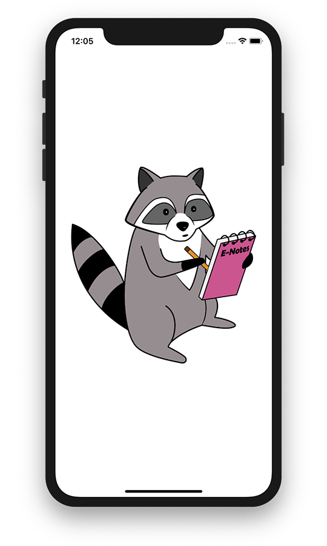

# ENotes

> Данная программа была написана в рамках курса «Разработка под iOS», проводившегося сотрудниками компании «Яндекс» на платформе “Stepik” в период с июня по август 2019.
>
> В настоящий момент данный курс закрыт, и согласно официальной информации его перезапуск не планируется. Все видео курса выложены компанией «Яндекс» в свободный доступ, и доступны для просмотра всеми желающими на платформе ~~«Яндекс.Видео»~~ “YouTube”:
> * [Разработка под iOS. Начинаем](https://www.youtube.com/playlist?list=PLQC2_0cDcSKA0zy20X9c5rQKNg3rkSK7c)
> * [Разработка под iOS. Взлетаем](https://www.youtube.com/playlist?list=PLQC2_0cDcSKAcuWNsWAwF8GT_lCU9QZNs)
>
> Конспект и задания любезно сохранены одним из участников данных курсов, Романом Бровко, и доступны для ознакомления в виде [репозитория на GitHub](https://github.com/programming086/note-course).

&nbsp;
## Логотип ENote

В рамках курса ученикам предлагалось разработать приложение для ведения заметок. В качестве проверки выполнения работы было предусмотрено проверочное тестирование приложений в формате peer review, т.е. сами участники курса проверяли работы друг друга.

Дабы выделиться из сотен одинаковых работ с логотипом в виде записной книжки, было принято решение нарисовать свой собственный логотип. Довольно быстро родилась идея обыграть схожесть слов "note" – "енот" (electronic note), и для использования в качестве маскота приложения был придуман, и нарисован енот с записной книжкой в лапках.

Этапы жизни «Енота»:

| Карандаш                    | Вектор                       | Приложение                  |
| --------------------------- | ---------------------------- | --------------------------- |
|  |  |  |

Данное изображение в различных модификациях используется в виде логотипа, загрузочного экрана, а также экрана уведомления о превышении бесплатного лимита.

&nbsp;
## Текстовые заметки

Текстовые заметки можно добавлять, изменять, удалять, и менять их порядок.

<Gif

&nbsp;
## Создание и редактирование текстовой заметки

Страница редактирования заметки позволяет задать название, описание, конечную дату выполнения, а также присвоить заметке цвет.

### Поле описания

Поле описания заметки представляет собой TextView, с кастомным placeholder’ом, и изменяет свой размер в зависимости от размера содержимого текста заметки.

<Gif

### Поле задания даты

Для заметки может быть указана дата крайнего срока её выполнения.

<Gif

### Поле выбора цвета

У всех заметок есть цвет по умолчанию  (белый), но пользователь также может выбрать и любой другой цвет. Для индикации подтверждения выбора, на ячейке с цветом проставляется анимируемая галочка.

<Gif

Данная галочка отрисовывается программно, при помощи Core Animation, и может быть сконфигурирована под различные цвета и размеры.

<Gif

### Ячейка выбора нестандартного цвета

Последняя ячейка своим видом намекает, что является нестандартной ячейкой. Её можно выбрать также как и любую другую, но помимо этого, данную ячейку можно подержать, вызвав тем самым окно выбора цвета.

<Gif

Для того чтобы пользователь понял, что с данной ячейкой можно взаимодействовать длительным нажатием, к ней была добавлена анимация «расширяющихся кругов», прерываемая при прерывании касания.

<Gif

&nbsp;
## Окно выбора нестандартного цвета.

Данное окно представляет собой набор следующих нестандартных элементов, связанных общим ViewController’ом посредством делегатов:
•	селектор выбора яркости цвета
•	селектор выбора тона и насыщенности
•	окно, отображающее текущий выбранный цвет

При изменении любого параметра цвета, все остальные компоненты перерисовываются.

<Gif

При изменении ориентации устройства...

<Gif

&nbsp;
## HSBColor

Использование стандартных структур данных для работы с цветом, таких как UIColor и CGColor, для данной программы не подходят т.к. ...
Например...
По этой причине, для сохранения цвета в данной программе была введена нестандартная структура HSBColor, позволяющая работать с цветом как с тремя отдельными компонентами: hue (тон), saturation (насыщенность) и brightness (яркость).
Именно эти три компонента задаются в окне выбора нестандартного цвета, описанного выше.

&nbsp;
## Фотозаметки (котозаметки)

Фотозаметки, также как и текстовые, можно добавлять, изменять, удалять, и менять их порядок. Все изменения сопровождаются соответствующими анимациями.

<Gif

### Добавление фотозаметки

Фотозаметку можно добавить как с камеры, так и из библиотеки пользователя.

<Gif

### Адаптивный layout

Фотозаметки адаптируются под размер экрана пользователя, а также под ориентацию устройства. 
Например, на экран iPhone SE и iPhone 11 в вертикальной ориентации помещается по две заметки в ряд, а в горизонтальной экран iPhone 11 может вместить большее количество заметок. При этом UICollectionViewFlowLayout автоматически пересчитывает размер элементов таким образом, чтобы они занимали всё полезное пространство.

<Jpg

### Просмотр фото заметок

Фотозаметки можно просматривать при помощи встроенной галереи.

<Gif

&nbsp;
## Бесплатная демо-версия

В программе предусмотрен режим сборки с ограничением количества заметок. После превышения заданного лимита, бесплатная версия программы блокируется, и начинает вымогать у пользователя деньги.

<Gif

&nbsp;
## Локализация

Программа переведена на три языка: русский, английский и японский.

<Jpg

Каждый самурай в своей жизни должен:
* построить сад камней
* посадить сакуру
* вырастить гейшу
* взобраться на гору Фудзияма

Локализации были подвергнуты также и некоторые изображения.

| Русский                               | Английский                            | Японский                              |
| ------------------------------------- | ------------------------------------- | ------------------------------------- |
|  |  |  |

&nbsp;
## Тестирование

Для удобства тестирования различных языков в платной и бесплатной модификации, в программу было добавлено 6 конфигураций запуска приложения.

<Jpg

&nbsp;
## Сертификат

По факту завершения курса, на платформе “Stepik” ученикам выдавались очень полезные в хозяйстве электронные сертификаты от компании «Яндекс». Обладатели данных сертификатов были на рынке труда на вес золота, и с руками отрывались лучшими предприятиями в сфере IT, даже без собеседования.

Т.к. в настоящий момент курс закрыт, и официального способа получить сертификат больше нет, любой желающий может создать свой собственный сертификат самостоятельно, воспользовавшись программой [“Stepik Fake Certificate Generator”](https://github.com/aleksey-paykachev/stepik-fake-certificate-generator).
